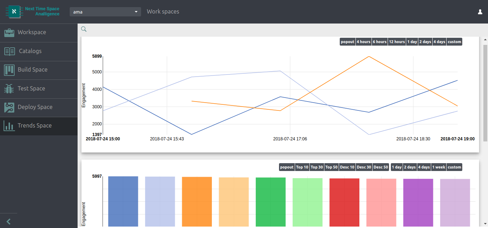

Analytics made easy ever
===

Hardest part of business tracking customer's mindset. Analligence helps to track/stat customer engagement in every div element you have in your page. Find customer interest sort your content or product recommendation. A beautiful trends shows customer impact on each and every segment you created.

 

200% faster analitics tracking. Business team can take care of all your business tracking needs. 

Creating segments allows business analyst to locate target segments that need tracking assesement. 

instantly enable or disable segments. Intelligent trending algorithm save data in the format of leaner or bar chart.

Deploy the analytics code the way you want. Also deploy to CDN we have to utilize most of the flexiblity to swap versions, add or remove segments instantly, yet scallable with caching. Any issues, enable "may day" code which is an empty analytics code to basically turn off all capturing.

